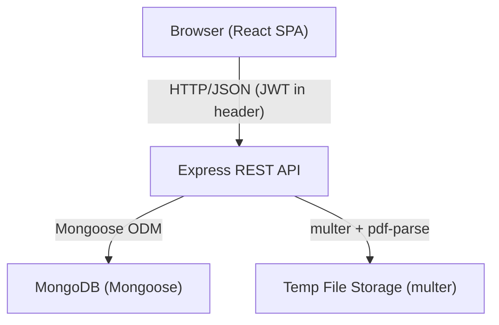
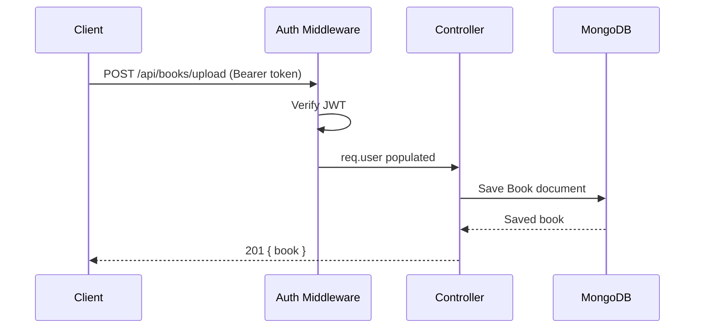

# Design Document: Readapt RSVP Platform

## Overview

Readapt is a full-stack web application with a React/TypeScript frontend and a Node.js/Express backend backed by MongoDB. Users register, upload PDFs, and read extracted text through an RSVP engine that flashes one word at a time with a highlighted Optimal Recognition Point (ORP) letter. Reading progress is persisted so sessions can be resumed.

The system is split into two independently runnable applications:
- `/client` — Vite-powered React + TypeScript SPA
- `/server` — Express.js REST API

---

## Architecture



### Request Flow



---

## Components and Interfaces

### Server Components

```
server/
  src/
    config/         # env, db connection
    middleware/     # auth (JWT verify)
    models/         # Mongoose schemas
    controllers/    # business logic
    routes/         # Express routers
    utils/          # pdf extraction, text cleaning
    index.ts        # entry point
```

#### Text Cleaning

The `utils/textCleaner.ts` module is responsible for post-extraction word normalization:

1. Split raw extracted text on whitespace
2. Strip leading/trailing punctuation from each token
3. Discard tokens that are empty or consist entirely of punctuation characters after stripping
4. Return the ordered array of clean word strings

*Rationale: Req 3.2 explicitly requires punctuation-only tokens and empty strings to be removed.*

#### Auth Middleware

```typescript
interface AuthRequest extends Request {
  user?: { id: string; email: string }
}

function authMiddleware(req: AuthRequest, res: Response, next: NextFunction): void
```

#### Controllers

| Controller | Methods |
|---|---|
| `authController` | `register`, `login` |
| `bookController` | `upload`, `getAll`, `getById` |
| `sessionController` | `update`, `getByBook` |
| `analyticsController` | `get` |

### Client Components

```
client/
  src/
    api/            # axios instance + typed API calls
    components/     # reusable UI (Button, Card, Input, Navbar)
    pages/          # Login, Register, Dashboard, Library, Reader
    hooks/          # useRSVP, useAuth
    context/        # AuthContext
    utils/          # orp.ts (ORP index calculation)
    App.tsx
    main.tsx
```

#### Key React Components

| Component | Responsibility |
|---|---|
| `RSVPReader` | Orchestrates RSVP display, controls, progress saving, completion detection |
| `WordDisplay` | Renders a single word with ORP letter highlighted and aligned |
| `ReaderControls` | Start / Pause / Resume / Reset buttons + WPM slider (100–1000) |
| `CompletionOverlay` | Shown when the last word is reached; indicates reading is complete |
| `BookCard` | Dashboard/library card showing book metadata |
| `ProtectedRoute` | Redirects unauthenticated users to login |

---

## Data Models

### User

```typescript
interface IUser {
  _id: ObjectId
  name: string
  email: string          // unique index
  passwordHash: string
  createdAt: Date
}
```

### Book

```typescript
interface IBook {
  _id: ObjectId
  userId: ObjectId       // ref: User
  title: string
  totalWords: number
  words: string[]        // extracted, cleaned word array
  createdAt: Date
}
```

### ReadingSession

```typescript
interface IReadingSession {
  _id: ObjectId
  userId: ObjectId       // ref: User
  bookId: ObjectId       // ref: Book
  lastWordIndex: number
  currentWPM: number
  timeSpent: number      // seconds
  date: Date
}
```

---

## ORP Algorithm

The ORP index is the letter position the eye should lock onto. The `getORPIndex` function is pure and deterministic:

```typescript
function getORPIndex(wordLength: number): number {
  if (wordLength <= 3) return Math.floor(wordLength / 2)
  if (wordLength <= 7) return Math.floor(wordLength / 4)
  return Math.floor(wordLength / 3) - 1
}
```

### Visual Alignment

To keep the ORP letter at a fixed horizontal position, `WordDisplay` splits each word into three spans:

```
[before ORP] [ORP letter] [after ORP]
```

The ORP letter span is absolutely positioned at a fixed `left` offset within a fixed-width container. The before-ORP span is right-aligned into that offset, and the after-ORP span flows naturally to the right. This ensures the highlighted letter never shifts horizontally between words.

```
Container (fixed width, e.g. 600px, position: relative)
  ├── <span class="before">  right-aligned, width = ORP_OFFSET
  ├── <span class="orp">     absolute, left = ORP_OFFSET, color: orange
  └── <span class="after">   left-aligned, starts after ORP letter
```

---

## RSVP Engine Behavior

The `useRSVP` hook encapsulates all playback state. Key behavioral rules:

- **WPM range**: accepted values are clamped to `[100, 1000]`. Any value outside this range is silently clamped before computing the interval. *Rationale: Req 5.6.*
- **Interval**: `intervalMs = Math.round(60_000 / wpm)`
- **Completion**: when the word index advances past the last word, the engine sets an `isComplete` flag to `true` and stops the timer. `RSVPReader` renders `CompletionOverlay` when this flag is set. *Rationale: Req 5.5.*
- **Resume**: on resume, playback continues from the current `wordIndex` without resetting. *Rationale: Req 5.3.*
- **Session seeding**: on book open, the client calls `GET /api/session/:bookId`; if a session exists, `useRSVP` is initialised with `lastWordIndex` as the starting position. *Rationale: Req 7.3.*

---

## UI and Visual Design

### Dark Theme

The application uses a dark color palette throughout. *Rationale: Req 10.1.*

- Background: `#0f0f0f` / `#1a1a1a`
- Primary text: `#e5e5e5`
- ORP highlight: orange (`#f97316`) — high contrast against dark backgrounds
- Accent / interactive: a muted blue or white

### Layout

- The RSVP word display area is centered both horizontally and vertically within the viewport using CSS flexbox. *Rationale: Req 10.2.*
- All pages use a responsive CSS layout (flexbox / CSS Grid) with breakpoints for mobile (< 768 px) and desktop. *Rationale: Req 10.3.*
- Shared UI primitives (`Button`, `Card`, `Input`, `Navbar`) are implemented as reusable React components in `client/src/components/`. *Rationale: Req 10.4.*

---

## API Design

### Auth

| Method | Path | Auth | Body | Response |
|---|---|---|---|---|
| POST | `/api/auth/register` | No | `{ name, email, password }` | `{ token, user }` |
| POST | `/api/auth/login` | No | `{ email, password }` | `{ token, user }` |

JWT tokens are signed with a secret read from the `JWT_SECRET` environment variable (never hardcoded) and expire after 24 hours. *Rationale: Req 2.1 mandates at least 24-hour validity; Req 9.4 mandates env-var secret.*

### Books

| Method | Path | Auth | Body/Params | Response |
|---|---|---|---|---|
| POST | `/api/books/upload` | Yes | multipart `file` | `{ book }` |
| GET | `/api/books` | Yes | — | `{ books[] }` |
| GET | `/api/books/:id` | Yes | `:id` | `{ book }` |

### Session

| Method | Path | Auth | Body | Response |
|---|---|---|---|---|
| POST | `/api/session/update` | Yes | `{ bookId, lastWordIndex, currentWPM, timeSpent }` | `{ session }` |
| GET | `/api/session/:bookId` | Yes | `:bookId` | `{ session \| null }` |

`GET /api/session/:bookId` returns the most recent ReadingSession for the authenticated user and the given book, or `null` if none exists. The client uses this on book open to seed the RSVP engine's starting word index. *Rationale: Req 7.3 requires the system to return the last saved word index when a user reopens a book; no endpoint existed for this.*

### Analytics

| Method | Path | Auth | Response |
|---|---|---|---|
| GET | `/api/analytics` | Yes | `{ totalWordsRead, booksUploaded, lastSession }` |

---

## Correctness Properties

*A property is a characteristic or behavior that should hold true across all valid executions of a system — essentially, a formal statement about what the system should do. Properties serve as the bridge between human-readable specifications and machine-verifiable correctness guarantees.*

### Property 1: ORP index is always within word bounds

*For any* word of length ≥ 1, `getORPIndex(word.length)` must return a value in the range `[0, word.length - 1]`.

**Validates: Requirements 6.1, 6.2, 6.3**

---

### Property 2: ORP index satisfies length-bracket rules

*For any* word, the ORP index returned must match the bracket rule for that word's length:
- length 1–3 → `floor(length / 2)`
- length 4–7 → `floor(length / 4)`
- length 8+ → `floor(length / 3) - 1`

**Validates: Requirements 6.1, 6.2, 6.3**

---

### Property 3: Word splitting round-trip

*For any* non-empty string of words separated by whitespace, splitting into words and then joining with a single space should produce a string whose word-set is equivalent to the original (order preserved, empty tokens removed).

**Validates: Requirements 3.2**

---

### Property 4: Password is never stored in plaintext

*For any* registered user, the `passwordHash` field stored in the database must not equal the original plaintext password.

**Validates: Requirements 1.4, 1.5**

---

### Property 5: Session upsert idempotence

*For any* (userId, bookId) pair, calling the session update endpoint twice with the same data should result in exactly one ReadingSession document in the database (upsert, not duplicate insert).

**Validates: Requirements 7.2**

---

### Property 6: Book ownership isolation

*For any* two distinct users A and B, user A's book list must contain no books belonging to user B.

**Validates: Requirements 4.1, 9.3**

---

### Property 7: Analytics totals are consistent with session data

*For any* user, the `totalWordsRead` value returned by the analytics endpoint must equal the sum of `lastWordIndex` values across all of that user's ReadingSession documents.

**Validates: Requirements 8.1, 8.4**

---

### Property 8: WPM is always clamped within valid range

*For any* WPM value supplied to the RSVP engine (including values below 100 or above 1000), the effective interval used for word advancement must correspond to a WPM in the range `[100, 1000]`.

**Validates: Requirements 5.6**

---

## Error Handling

| Scenario | HTTP Status | Message |
|---|---|---|
| Missing required field | 400 | Field name + "is required" |
| Non-PDF upload | 400 | "Only PDF files are accepted" |
| Invalid credentials | 401 | "Invalid email or password" |
| Missing/invalid JWT | 401 | "Unauthorized" |
| Access to another user's resource | 403 | "Forbidden" |
| Resource not found | 404 | "Not found" |
| Duplicate email on register | 409 | "Email already in use" |
| PDF parse failure | 422 | "Could not extract text from PDF" |
| Unexpected server error | 500 | "Internal server error" |

All error responses follow the shape: `{ error: string }`.

---

## Testing Strategy

### Dual Testing Approach

Both unit tests and property-based tests are required and complementary:

- **Unit tests** verify specific examples, edge cases, and error conditions (e.g., ORP index for a 5-letter word returns exactly 1, empty word array is rejected).
- **Property-based tests** verify universal properties across randomly generated inputs (e.g., ORP index is always in bounds for any word length).

### Property-Based Testing

- Library: **fast-check** (TypeScript-compatible, works in both Node and browser environments)
- Minimum **100 iterations** per property test
- Each property test must reference its design document property via a comment:
  - Tag format: `// Feature: readapt-rsvp-platform, Property N: <property_text>`

### Unit Testing

- Framework: **Jest** (server) + **Vitest** (client)
- Focus areas:
  - ORP index calculation for boundary values (length 1, 3, 4, 7, 8, 20)
  - Auth middleware rejects missing/expired tokens
  - Book controller returns 403 for wrong user
  - Session upsert creates one document on first call, updates on second
  - `GET /api/session/:bookId` returns `null` when no session exists, and the session document when one does
  - Analytics aggregation returns correct totals
  - WPM values below 100 are clamped to 100; values above 1000 are clamped to 1000
  - RSVP engine sets `isComplete` after advancing past the last word

### Coverage Targets

- ORP utility: 100% branch coverage
- Auth middleware: 100% branch coverage
- Controllers: happy path + primary error paths
